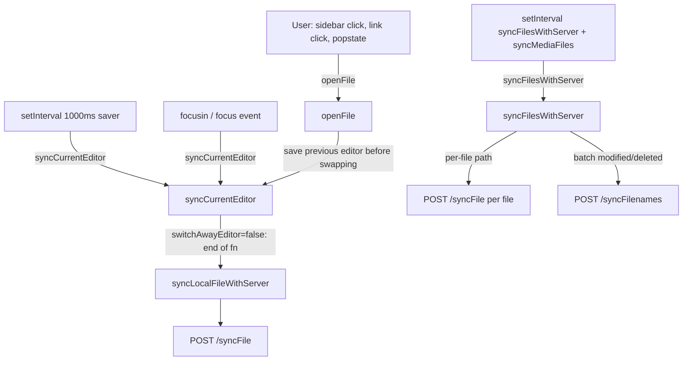
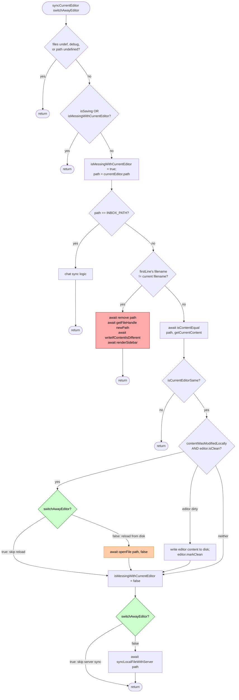
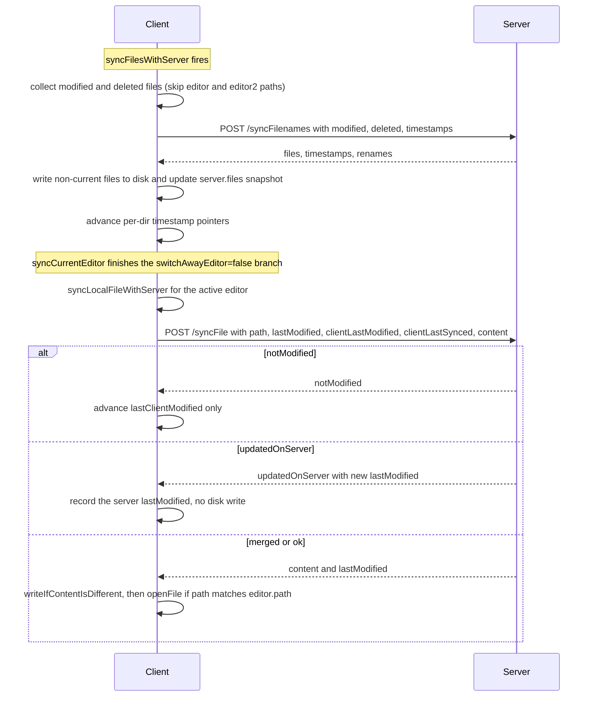
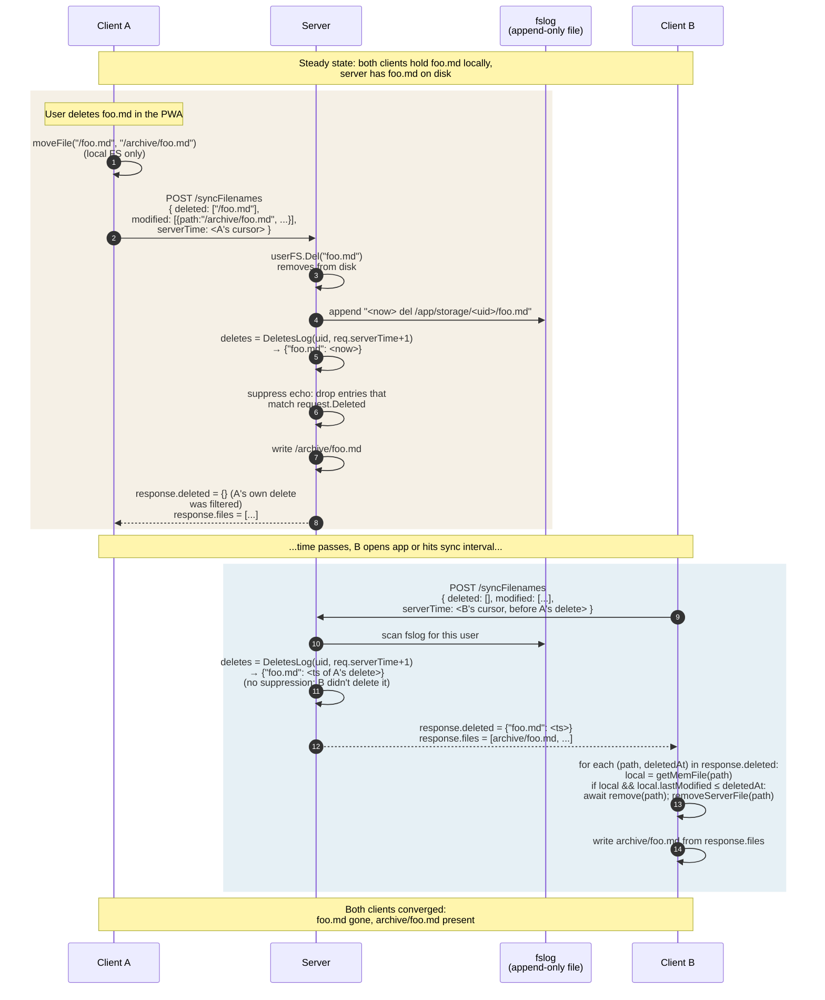

# Sync flow

How `openFile`, `syncCurrentEditor`, `syncFilesWithServer`, and `syncLocalFileWithServer` hand off work, and how the server knows what to send or receive.

## Triggers and who calls whom

The red node is the drift-seal line (files.js:1028). If `currentEditor` was rotated by anything during the yellow await above, this write lands on the wrong editor instance.

## syncCurrentEditor - both flag branches

The two green gates are the `switchAwayEditor` branches. The orange `Reload` is the one we neutralised (it used to recurse into `openFile` without an `el` arg and clobber the main editor). The red `Rename` block is the executioner that actually deletes and creates files on disk - still live, fires whenever first-line header disagrees with filename.

## Sync with the server - batch vs per-file

### How the server knows there's something to sync

Two mechanisms, running in parallel:

1. **Batch: `syncFilesWithServer` → `POST /syncFilenames`.** The client sends:
   - `modified`: files whose disk `lastModified` is newer than the `lastClientSynced` pointer recorded in `server.files` for that path.
   - `deleted`: files present in the client's `server.files` snapshot but no longer on disk.
   - `timestamps`: a per-directory pointer telling the server "everything I've seen up to here." The server replies with files newer than each directory's pointer. **The two currently-open editor files are skipped on both send and receive** (`files.js:230` and `files.js:577`) - they're handled by the per-file path instead, to avoid racing with the user's active edits.

2. **Per-file: `syncLocalFileWithServer` → `POST /syncFile`.** Called at the end of each `syncCurrentEditor` (when `switchAwayEditor=false`). Sends the single file's content plus its `lastModified` + `clientLastModified` + `clientLastSynced`. The server compares timestamps and responds with one of four statuses that the client maps to either "advance pointers only" or "write this content to disk."

The client's `server.files` object holds the triple `(content, lastModified, lastClientModified)` per path - this is the client's view of what the server thinks the world looks like, and the basis for deciding which files to include in the next `modified`/`deleted` lists. Persisted to `localStorage` under `SERVER_STORAGE_KEY`.

### Auth gate: `lastServerOk`

The auth token lives in an HttpOnly cookie, so JS can't see it directly. Instead, every successful response from the server stamps `localStorage.lastServerOk` with `Date.now()` via `markServerOk()` (files.js). `hasLastServerOk()` returns true if that key exists - which it only can if the server has previously accepted us. Use this as the gate before kicking off sync work: no stamp ⇒ no token ⇒ skip the request entirely. The flag is set in:

- `app.js` after the `/issuePermanentToken` exchange returns 200
- `post()` after a 2xx response (covers all `/syncFilenames`, `/syncFile`, `/syncMediaFilenames`, `/syncMediaFile` upload calls now that they go through this helper)
- `syncMediaFiles` directly after the raw `POST /syncMediaFile` download (binary blob, can't share `post()`)

If the server later 401s, the stamp stays - but the request will simply fail and no sync state advances, so we don't need to clear it.

## File deletion propogation across clients

A delete on one device has to travel through the server and reach every other device that still holds the file. The mechanism is an append-only `fslog` on disk: every server-side `userFS.Del` writes a `<ts> del <abs-path>` row, and every `/syncFilenames` response carries the deletes a given client hasn't seen yet.

### Why we need this log at all

Without it, the server only knows what currently exists on disk - it has no memory of what *used* to exist. Sync responses only list present files. So Client B, which still holds the deleted file locally, would see "this path is on my disk but not in the server response" and conclude it's a *new* local file → it would re-upload `foo.md` and the file resurrects. The fslog gives the server a memory of deletions, so it can tell B "yes, this used to exist, but it was deleted at time T - drop your stale copy."

